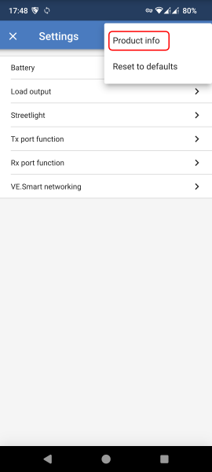
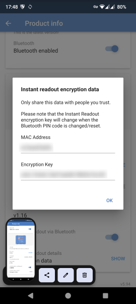
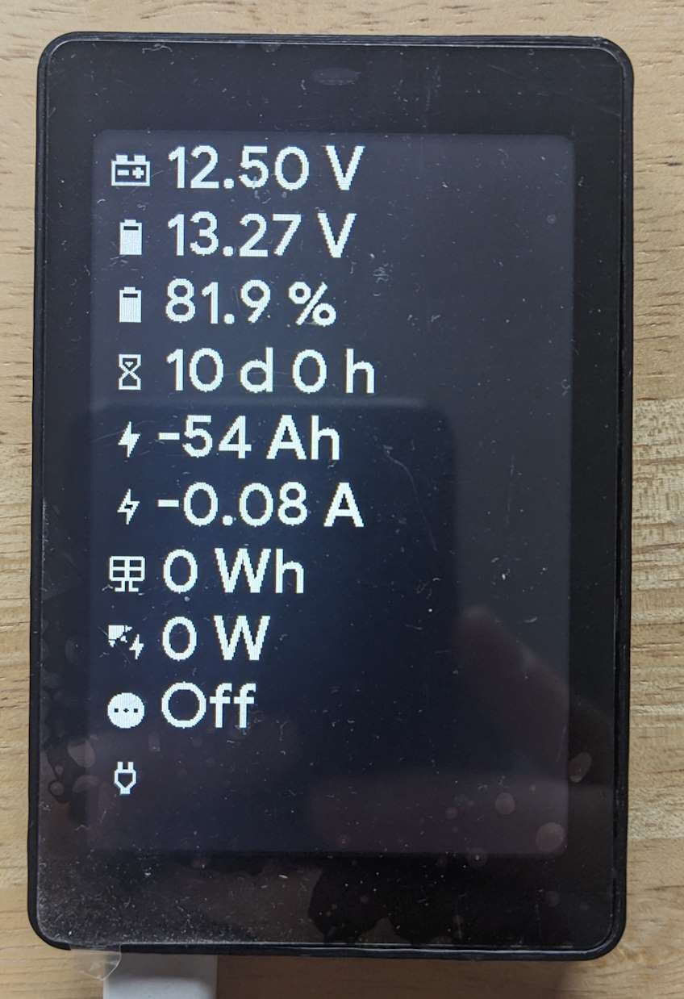

# ESPHome victron_ble component

**This repository is in no way approved by or affiliated with the official Victron Energy repository.**

**I am not responsible for any problems or damages with your devices or this code**

The goal of this component is to use the Victron Bluetooth Advertising protocol and expose all available data as ESPHome sensors.

Victron Bluetooth Advertising protocol data is also used by the Victron App on the Overview page (before you connect to a device).

This [ESPHome](https://esphome.io) component supports both official Victron Bluetooth BLE Protocols:

- (Recommended) [Bluetooth advertising protocol](https://community.victronenergy.com/questions/187303/victron-bluetooth-advertising-protocol.html) - Component `victron_ble`.
  - Supported Devices:
    - Smart Shunt
    - Smart Solar
    - Inverter
    - DC/DC converter
    - SmartLithium
      - Missing definition for `bms_flags` and `error`.
    - Inverter RS
    - AC Charger
    - Smart Batery Protect
      - Missing definition for `output_state`.
    - Smart Battery Sense
    - (Lynx Smart) BMS
      - Missing definition for `error`, `io_status` and `warnings_alarms`.
    - Multi RS
    - VE.Bus
      - Missing definition for `ve_bus_error`.
    - DC Energy Meter
      - Missing definition for `bmv_monitor_mode`.
    - Orion XS
    - Blue Smart Chargers
      - Requires Firmware v3.61 or higher. Available in VictronConnect App v6.10beta14 (2024-09-28).
  -  Not suported. Awaiting final documentation or example log from device:
    - GX-Device

## `victron_ble` component (Recommended)

To connect to your Victron device you must have two information for each device:

- `mac_address` -  Bluetooth mac address of device.
- `bindkey` - AES encryption key.

Use [VictronConnect App v5.93](https://www.victronenergy.com/live/victronconnect:beta) (or later) released on 2023-08-25.





1. Open "Settings" of Device.
2. Open "Product Info" page.
3. Ensure `Instant readout via Bluetooth` is enabled.
4. Bottom of page press `SHOW` for Instant readout details Encryption data.

When connected to the device via VictronConnect App no Instant readout (Bluetooth advertising) data is generated.

### Example ESPHome configuration for `victron_ble` using SmartShunt and SmartSolar

See [victron_ble.yaml](/victron_ble.yaml) for a full example.

```yaml
esphome:
  name: "victron-ble"

external_components:
  - source: github://Fabian-Schmidt/esphome-victron_ble

esp32:
  board: esp32dev

logger:
  level: DEBUG

esp32_ble_tracker:

victron_ble:
  - id: MySmartShunt
    mac_address: "MY SMART SHUNT MAC"    
    bindkey: "MY AES ENCRYPTION KEY"
  - id: MySmartSolar
    mac_address: "MY SMART SOLAR MAC"
    bindkey: "MY AES ENCRYPTION KEY"

sensor:
  # MySmartShunt
  - platform: victron_ble
    victron_ble_id: MySmartShunt
    name: "Time remaining"
    type: TIME_TO_GO
  - platform: victron_ble
    victron_ble_id: MySmartShunt
    name: "Battery Voltage"
    type: BATTERY_VOLTAGE
  - platform: victron_ble
    victron_ble_id: MySmartShunt
    name: "Starter Battery Voltage"
    # AUX_VOLTAGE or MID_VOLTAGE or TEMPERATURE.
    # Depending on configuration of SmartShunt.
    type: AUX_VOLTAGE
  - platform: victron_ble
    victron_ble_id: MySmartShunt
    name: "Battery Current"
    type: BATTERY_CURRENT
  - platform: victron_ble
    victron_ble_id: MySmartShunt
    name: "Consumed Ah"
    type: CONSUMED_AH
  - platform: victron_ble
    victron_ble_id: MySmartShunt
    name: "State of charge"
    type: STATE_OF_CHARGE

  # MySmartSolar
  - platform: victron_ble
    victron_ble_id: MySmartSolar
    name: "MPPT Output Voltage"
    type: BATTERY_VOLTAGE
  - platform: victron_ble
    victron_ble_id: MySmartSolar
    name: "MPPT Output Current"
    type: BATTERY_CURRENT
  - platform: victron_ble
    victron_ble_id: MySmartSolar
    name: "MPPT Yield Today"
    type: YIELD_TODAY
  - platform: victron_ble
    victron_ble_id: MySmartSolar
    name: "MPPT PV Power"
    type: PV_POWER
  - platform: victron_ble
    victron_ble_id: MySmartSolar
    name: "MPPT Load Current"
    type: LOAD_CURRENT

binary_sensor:
  - platform: victron_ble
    victron_ble_id: MySmartShunt
    name: "Battery has Alarm"
    type: ALARM

  - platform: victron_ble
    victron_ble_id: MySmartSolar
    name: "MPPT is in Fault state"
    type: DEVICE_STATE_FAULT
  - platform: victron_ble
    victron_ble_id: MySmartSolar
    name: "MPPT has Error"
    type: CHARGER_ERROR

text_sensor:
  - platform: victron_ble
    victron_ble_id: MySmartShunt
    name: "Battery Alarm reason"
    type: ALARM_REASON

  - platform: victron_ble
    victron_ble_id: MySmartSolar
    name: "MPPT state"
    type: DEVICE_STATE
  - platform: victron_ble
    victron_ble_id: MySmartSolar
    name: "MPPT Error reason"
    type: CHARGER_ERROR
```

### `victron_ble` component configuration

The following settings exist:

- `mac_address` - The MAC address of your Victron device.
- `bindkey` - The AES encryption key of your Victron device.
- [Automation Triggers](https://esphome.io/guides/automations.html):
  - `on_message` - When any message is received.
  - `on_battery_monitor_message` - When a battery monitor message is received.
  - `on_solar_charger_message` - When a solar charger message is received.
  - `on_inverter_message` - When a inverter message is received.
  - `on_dcdc_converter_message` - When a DC/DC converter message is received.
  - `on_smart_lithium_message` - When a smart Lithium message is received.
  - `on_inverter_rs_message` - When a Inverter RS message is received.
  - `on_ac_charger_message` - When a AC Charger message is received.
  - `on_smart_battery_protect_message` - When a Smart Battery Protect message is received.
  - `on_lynx_smart_bms_message` - When a Lynx (Smart BMS) message is received.
  - `on_multi_rs_message` - When a Multi RS message is received.
  - `on_ve_bus_message` - When a VE.Bus message is received.
  - `on_dc_energy_meter_message` - When a DC Energy meter message is received.
  - `on_orion_xs_message` - When a Orion XS message is received.

### Sensor

The following `type` are supported by the `sensor` component:

|                      | Unit | Solar charger | Battery monitor | Inverter | DC/DC converter | SmartLithium | Inverter RS | AC Charger | Smart Battery Protect | (Lynx Smart) BMS | Multi RS | VE.Bus | DC Energy Meter | Orion XS |
| -------------------- | ---- | ------------- | --------------- | -------- | --------------- | ------------ | ----------- | ---------- | --------------------- | ---------------- | -------- | ------ | --------------- | -------- |
| `ACTIVE_AC_IN`       |      |               |                 |          |                 |              |             |            |                       |                  | X        | X      |                 |          |
| `ACTIVE_AC_IN_POWER` | W    |               |                 |          |                 |              |             |            |                       |                  | X        | X      |                 |          |
| `AC_APPARENT_POWER`  | VA   |               |                 | X        |                 |              |             |            |                       |                  |          |        |                 |          |
| `AC_CURRENT`         | A    |               |                 | X        |                 |              |             | X          |                       |                  |          |        |                 |          |
| `AC_OUT_POWER`       | W    |               |                 |          |                 |              | X           |            |                       |                  | X        | X      |                 |          |
| `AC_VOLTAGE`         | V    |               |                 | X        |                 |              |             |            |                       |                  |          |        |                 |          |
| `ALARM_REASON`       |      |               | X               | X        |                 |              |             |            | X                     |                  |          |        | X               |          |
| `AUX_VOLTAGE`        | V    |               | X(1)            |          |                 |              |             |            |                       |                  |          |        | X(1)            |          |
| `BATTERY_CURRENT`    | A    | X             | X               |          |                 |              | X           | X          |                       | X                | X        | X      | X               |          |
| `BATTERY_VOLTAGE`    | V    | X             | X               | X        |                 | X            | X           | X          |                       | X                | X        | X      | X               |          |
| `BATTERY_POWER`      | W    | X             | X               |          |                 |              | X           | X          |                       | X                | X        | X      | X               |          |
| `CHARGER_ERROR`      |      | X             |                 |          | X               |              | X           | X          |                       |                  | X        |        |                 | X        |
| `CONSUMED_AH`        | Ah   |               | X               |          |                 |              |             |            |                       | X                |          |        |                 |          |
| `DEVICE_STATE`       |      | X             |                 | X        | X               |              | X           | X          | X                     |                  | X        | X      |                 | X        |
| `ERROR`              |      |               |                 |          |                 | X            |             |            | X                     | X                |          | X      |                 |          |
| `INPUT_VOLTAGE`      | V    |               |                 |          | X               |              |             |            | X                     |                  |          |        |                 | X        |
| `LOAD_CURRENT`       | A    | X             |                 |          |                 |              |             |            |                       |                  |          |        |                 |          |
| `LOAD_POWER`         | W    | X             |                 |          |                 |              |             |            |                       |                  |          |        |                 |          |
| `OFF_REASON`         |      |               |                 |          | X               |              |             |            | X                     |                  |          |        |                 | X        |
| `OUTPUT_VOLTAGE`     | V    |               |                 |          | X               |              |             |            | X                     |                  |          |        |                 | X        |
| `MID_VOLTAGE`        | V    |               | X(1)            |          |                 |              |             |            |                       |                  |          |        |                 |          |
| `PV_POWER`           | W    | X             |                 |          |                 |              | X           |            |                       |                  | X        |        |                 |          |
| `STATE_OF_CHARGE`    | %    |               | X               |          |                 |              |             |            |                       | X                |          | X      |                 |          |
| `TEMPERATURE`        | °C   |               | X(1)            |          |                 | X            |             | X          |                       | X(2)             |          | X      | X(1)            |          |
| `TIME_TO_GO`         | min  |               | X               |          |                 |              |             |            |                       | X                |          |        |                 |          |
| `YIELD_TODAY`        | kWh  | X             |                 |          |                 |              | X           |            |                       |                  | X        |        |                 |          |
| `BALANCER_STATUS`    |      |               |                 |          |                 | X            |             |            |                       |                  |          |        |                 |          |
| `BMS_FLAGS`          |      |               |                 |          |                 | X            |             |            |                       |                  |          |        |                 |          |
| `CELL1`              | V    |               |                 |          |                 | X            |             |            |                       |                  |          |        |                 |          |
| `CELL2`              | V    |               |                 |          |                 | X            |             |            |                       |                  |          |        |                 |          |
| `CELL3`              | V    |               |                 |          |                 | X            |             |            |                       |                  |          |        |                 |          |
| `CELL4`              | V    |               |                 |          |                 | X            |             |            |                       |                  |          |        |                 |          |
| `CELL5`              | V    |               |                 |          |                 | X            |             |            |                       |                  |          |        |                 |          |
| `CELL6`              | V    |               |                 |          |                 | X            |             |            |                       |                  |          |        |                 |          |
| `CELL7`              | V    |               |                 |          |                 | X            |             |            |                       |                  |          |        |                 |          |
| `CELL8`              | V    |               |                 |          |                 | X            |             |            |                       |                  |          |        |                 |          |
| `OUTPUT_STATE`       |      |               |                 |          |                 |              |             |            | X                     |                  |          |        |                 |          |
| `WARNING_REASON`     |      |               |                 |          |                 |              |             |            | X                     |                  |          |        |                 |          |
| `IO_STATUS`          |      |               |                 |          |                 |              |             |            |                       | X                |          |        |                 |          |
| `WARNINGS_ALARMS`    |      |               |                 |          |                 |              |             |            |                       | X                |          |        |                 |          |
| `ALARM`              |      |               |                 |          |                 |              |             |            |                       |                  |          | X      |                 |          |
| `BMV_MONITOR_MODE`   |      |               |                 |          |                 |              |             |            |                       |                  |          |        | X               |          |
| `OUTPUT_CURRENT`     | A    |               |                 |          |                 |              |             |            |                       |                  |          |        |                 | X        |
| `INPUT_CURRENT`      | A    |               |                 |          |                 |              |             |            |                       |                  |          |        |                 | X        |
| `OUTPUT_POWER`       | W    |               |                 |          |                 |              |             |            |                       |                  |          |        |                 | X        |
| `INPUT_POWER`        | W    |               |                 |          |                 |              |             |            |                       |                  |          |        |                 | X        |
| `BATTERY_CURRENT_2`  | A    |               |                 |          |                 |              |             | X          |                       |                  |          |        |                 |          |
| `BATTERY_VOLTAGE_2`  | V    |               |                 |          |                 |              |             | X          |                       |                  |          |        |                 |          |
| `BATTERY_POWER_2`    | W    |               |                 |          |                 |              |             | X          |                       |                  |          |        |                 |          |
| `BATTERY_CURRENT_3`  | A    |               |                 |          |                 |              |             | X          |                       |                  |          |        |                 |          |
| `BATTERY_VOLTAGE_3`  | V    |               |                 |          |                 |              |             | X          |                       |                  |          |        |                 |          |
| `BATTERY_POWER_3`    | W    |               |                 |          |                 |              |             | X          |                       |                  |          |        |                 |          |

(1) - Available if device aux port is configured.
(2) - Not available on all models. `NAN` reported if not available.

### Binary Sensor

The following `type` are supported by the `binary_sensor` component:

|                                    | Solar charger | Battery monitor | Inverter | DC/DC converter | SmartLithium | Inverter RS | AC Charger | Smart Battery Protect | (Lynx Smart) BMS | Multi RS | VE.Bus | DC Energy Meter | Orion XS |
| ---------------------------------- | ------------- | --------------- | -------- | --------------- | ------------ | ----------- | ---------- | --------------------- | ---------------- | -------- | ------ | --------------- | -------- |
| `ALARM`                            |               | X               | X        |                 |              |             |            | X                     |                  |          |        | X               |          |
| `CHARGER_ERROR`                    | X             |                 |          | X               |              | X           | X          |                       |                  | X        |        |                 | X        |
| `DEVICE_STATE_OFF`                 | X             |                 | X        | X               |              | X           | X          | X                     |                  | X        | X      |                 | X        |
| `DEVICE_STATE_LOW_POWER`           |               |                 |          |                 |              | ?           | ?          |                       |                  | ?        | ?      |                 |          |
| `DEVICE_STATE_FAULT`               | X             |                 | X        | X               |              | X           | X          | X                     |                  | X        | X      |                 | X        |
| `DEVICE_STATE_BULK`                | X             |                 |          |                 |              | ?           | X          |                       |                  | ?        | ?      |                 | X        |
| `DEVICE_STATE_ABSORPTION`          | X             |                 |          |                 |              | ?           | X          |                       |                  | ?        | ?      |                 | X        |
| `DEVICE_STATE_FLOAT`               | X             |                 |          |                 |              | ?           | ?          |                       |                  | ?        | ?      |                 | X        |
| `DEVICE_STATE_STORAGE`             |               |                 |          |                 |              | ?           | ?          |                       |                  | ?        | ?      |                 |          |
| `DEVICE_STATE_EQUALIZE_MANUAL`     | X             |                 |          |                 |              | ?           | ?          |                       |                  | ?        | ?      |                 |          |
| `DEVICE_STATE_INVERTING`           |               |                 |          |                 |              | ?           | ?          |                       |                  | ?        | ?      |                 |          |
| `DEVICE_STATE_POWER_SUPPLY`        |               |                 |          |                 |              | ?           | X          |                       |                  | ?        | ?      |                 |          |
| `DEVICE_STATE_SUSTAIN`             |               |                 |          |                 |              | ?           | ?          |                       |                  | X        | ?      |                 |          |
| `DEVICE_STATE_STARTING_UP`         | X             |                 |          |                 |              | ?           | ?          |                       |                  | ?        | ?      |                 |          |
| `DEVICE_STATE_REPEATED_ABSORPTION` |               |                 |          |                 |              | ?           | ?          |                       |                  | ?        | ?      |                 |          |
| `DEVICE_STATE_AUTO_EQUALIZE`       | X             |                 |          |                 |              | ?           | ?          |                       |                  | ?        | ?      |                 |          |
| `DEVICE_STATE_BATTERY_SAFE`        |               |                 |          |                 |              | ?           | ?          |                       |                  | ?        | ?      |                 |          |
| `DEVICE_STATE_LOAD_DETECT`         |               |                 |          |                 |              | ?           | ?          | ?                     |                  | ?        | ?      |                 |          |
| `DEVICE_STATE_BLOCKED`             |               |                 |          |                 |              | ?           | ?          | ?                     |                  | ?        | ?      |                 |          |
| `DEVICE_STATE_TEST`                |               |                 |          |                 |              | ?           | ?          | ?                     |                  | ?        | ?      |                 |          |
| `DEVICE_STATE_EXTERNAL_CONTROL`    | X             |                 |          |                 |              | ?           | ?          |                       |                  | ?        | ?      |                 |          |
| `BMS_ALARM_OVER_VOLTAGE`           |               |                 |          |                 |              |             |            | X                     |                  |          |        |                 |          |
| `BMS_ALARM_UNDER_VOLTAGE`          |               |                 |          |                 |              |             |            | X                     |                  |          |        |                 |          |
| `BMS_WARN_UNDER_VOLTAGE`           |               |                 |          |                 |              |             |            | X                     |                  |          |        |                 |          |
| `BMS_ALARM_OVER_TEMPERATURE`       |               |                 |          |                 |              |             |            | X                     |                  |          |        |                 |          |
| `BMS_ALARM_UNDER_TEMPERATURE`      |               |                 |          |                 |              |             |            | X                     |                  |          |        |                 |          |
| `BMS_ALARM_HARDWARE_FAILURE`       |               |                 |          |                 |              |             |            | X                     |                  |          |        |                 |          |
| `BMS_ALLOWED_TO_CHARGE`            |               |                 |          |                 |              |             |            | X                     |                  |          |        |                 |          |
| `BMS_ALLOWED_TO_DISCHARGE`         |               |                 |          |                 |              |             |            | X                     |                  |          |        |                 |          |

? - Device submits a device state. Not sure if it can enter this stage.

### Text Sensor

The following `type` are supported by the `text_sensor` component:

|                   | Solar charger | Battery monitor | Inverter | DC/DC converter | SmartLithium | Inverter RS | AC Charger | Smart Battery Protect | (Lynx Smart) BMS | Multi RS | VE.Bus | DC Energy Meter | Orion XS |
| ----------------- | ------------- | --------------- | -------- | --------------- | ------------ | ----------- | ---------- | --------------------- | ---------------- | -------- | ------ | --------------- | -------- |
| `ACTIVE_AC_IN`    |               |                 |          |                 |              |             |            |                       |                  | X        | X      |                 |          |
| `ALARM_REASON`    |               | X               | X        |                 |              |             |            | X                     |                  |          |        | X               |          |
| `CHARGER_ERROR`   | X             |                 |          | X               |              | X           | X          |                       |                  | X        |        |                 | X        |
| `DEVICE_STATE`    | X             |                 | X        | X               |              | X           | X          | X                     |                  | X        | X      |                 | X        |
| `OFF_REASON`      |               |                 |          | X               |              |             |            | X                     |                  |          |        |                 | X        |
| `ERROR_CODE`      |               |                 |          |                 |              |             |            | X                     |                  |          |        |                 |          |
| `WARNING_REASON`  |               |                 |          |                 |              |             |            | X                     |                  |          |        |                 |          |
| `OUTPUT_STATE`    |               |                 |          |                 |              |             |            | X                     |                  |          |        |                 |          |
| `ALARM`           |               |                 |          |                 |              |             |            |                       |                  |          | X      |                 |          |
| `BALANCER_STATUS` |               |                 |          |                 | X            |             |            |                       |                  |          |        |                 |          |


## Display

Example using this library standalone without HomeAssistant to display SmartShunt and (multiple) SmartSolar values.

As this uses Bluetooth advertisement packages you can have multiple device (displays) receive the same information without issues.

The [config WT32-SC01](victron_ble_display_wt32-sc01.yaml) displays the following information:

1. SmartShunt AUX Voltage
2. SmartShunt Battery Voltage
3. SmartShunt State of Charge in %
4. SmartShunt Battery time remaining
5. SmartShunt Consumed Ah
6. SmartShunt Battery Current
7. SmartSolar Yield Today
8. SmartSolar PV Power
9. SmartSolar Device State (Off, Bulk, Absorption, Float ...)
10. SmartSolar Load output



Any [Display supported by ESPHome](https://esphome.io/#display-hardware-platforms) can be used / adopted.

## Frequently Asked Questions

### Can you please provide more sensor data from Device x?

Only if the data is visible in the Victron App on the overview page, before you connect to the device.

The Victron App is using two different protocols to transfer the data. This component is only using the Victron Bluetooth Advertising protocol same as in the Victron App overview page.

### Limit Message to Home Assistant / Sensor Update Interval configuration

By default the component submits all recieved sensor packages to Home Assistant.

ESPHome as an extensive list of filters you add to your sensor to adjust the submitted data.  
For example you can use the following filter config so it sends an average reading every 1 minute and will send a NAN if nothing is received within 2 minutes.

```ỳaml
- platform: victron_ble
    victron_ble_id: MySmartShunt
    name: "SmartShunt Current"
    type: BATTERY_CURRENT
    filters:
      - throttle_average: 60s
      - timeout: 120s
```

See also [ESPHome Sensor Filters](https://esphome.io/components/sensor/index.html#sensor-filters).

### victron_ble:161 incorrect bindkey

The component expects the bindkey to be 32 characters long. Check in the Victron App sometimes the last character is in a invisible second line. Use the clipboard button in the Victron App to copy the bindkey.

If the bindkey is 31 characters long you must reset the bluetooth PIN on the victron device to get a 32 character bindkey.

### Which sensor are avaible for my Victron Device

Each Victron Device is submitting one type of messages (one column in the tables above). Either based ob the device type or based on what you can see in the Victron App Overview Page you can derive the Victron message type.

## Your support

I don't have access to all Victron devices. Please provide feedback if the component is working and all values are correct and match the reading within the Victron app. Only after I got feedback for all devices I can try to get this merged into ESP Home. Given the size of this component I don't expect this soon or be a quick process.

Missing feedback for the following devices:

- SmartLithium
  - Missing definition for `bms_flags` and `error`.
- Smart Batery Protect
  - Missing definition for `output_state`.
- (Lynx Smart) BMS
  - Missing definition for `error`, `io_status` and `warnings_alarms`.
- Multi RS
- VE.Bus
  - Missing definition for `ve_bus_error`.
- DC Energy Meter
